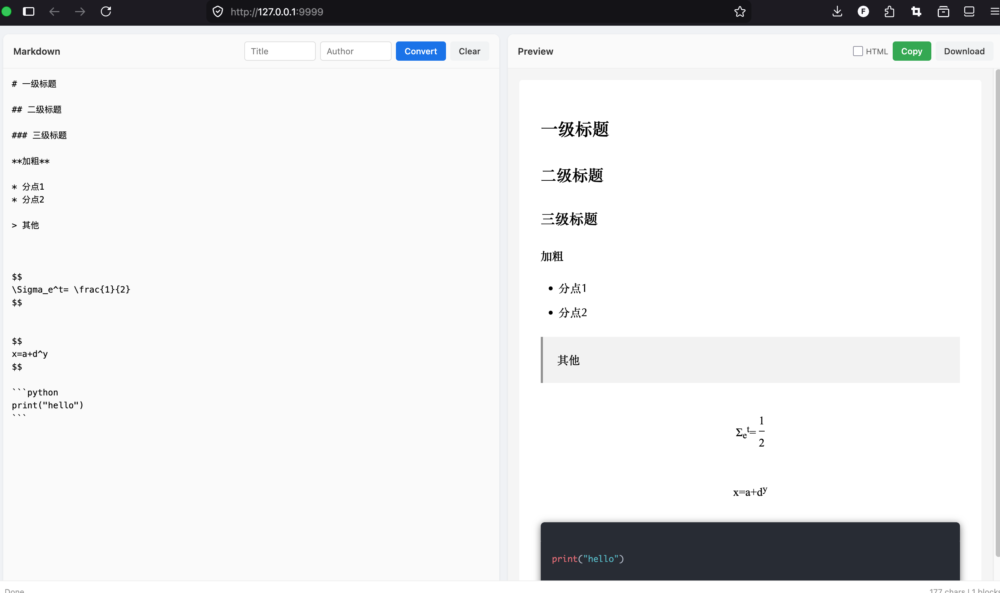

# Xie（写）

一行命令把 Markdown 转成微信公众号可用的 HTML。支持命令行、Python 库和网页版。

**Xie** 是"写"的拼音，寓意让写作更简单。

## 解决的问题

用 Markdown 写完文章，想发到微信公众号，还得手动转 HTML？微信公众号只支持部分 HTML 标签，普通转换器输出的代码粘贴过去格式全乱。

Xie 自动处理这些兼容性问题，输出的是微信公众号编辑器能正确解析的 HTML，复制粘贴即可。

## 快速上手

```bash
# 安装
pip install xie

# 转换文件
xie convert test.md -o test.html

# 管道输入
echo "# 你好" | xie
```

## 安装方式

```bash
# 从 PyPI 安装
pip install xie

# 带网页支持
pip install xie[all]

# 从源码安装
git clone https://github.com/cycleuser/xie.git
cd xie
pip install -e .
```

## 使用方式

### 命令行

```bash
# 基本转换
xie convert test.md -o test.html

# 生成完整文档（含标题、作者、样式）
xie convert test.md --standalone --title "我的文章" --author "张三" -o test.html

# JSON 格式输出
xie convert test.md --json
```

### Python 库

```python
from xie import convert_markdown_to_wechat

result = convert_markdown_to_wechat("# 你好\n\n这是**粗体**文本")
if result.success:
    print(result.data['html'])
```

### 网页版

```bash
# 启动网页服务
xie web --port 5000
```

浏览器打开 http://localhost:5000，左边写 Markdown，右边实时预览微信公众号效果，点"Copy"直接获取可粘贴的 HTML。



## 功能特点

- **完整 Markdown 支持**：标题、粗体、斜体、链接、图片、代码块、表格、引用、列表
- **代码高亮**：基于 Pygments，支持 100+ 编程语言，颜色以内联样式输出
- **LaTeX 数学公式**：`$行内$` 和 `$$块级$$` 语法
- **微信兼容**：所有样式内联，无外部 CSS

## 支持的语法

```
# 标题           **粗体**        *斜体*        ~~删除线~~
[链接](地址)       `行内代码`    ```语言
> 引用           - 无序列表      1. 有序列表    | 表格 |
$行内公式$      $$块级公式$$
```

## 示例

输入 (`test.md`):

```markdown
# 一级标题

## 二级标题

**加粗**

* 分点1
* 分点2

> 引用

$$
\Sigma_e^t= \frac{1}{2}
$$

```python
print("hello")
```
```

输出：带内联样式的微信兼容 HTML。

## 环境要求

- Python 3.8+
- mistune（Markdown 解析）
- Pygments（代码高亮）
- Flask（可选，网页服务）

## 开源协议

GPLv3